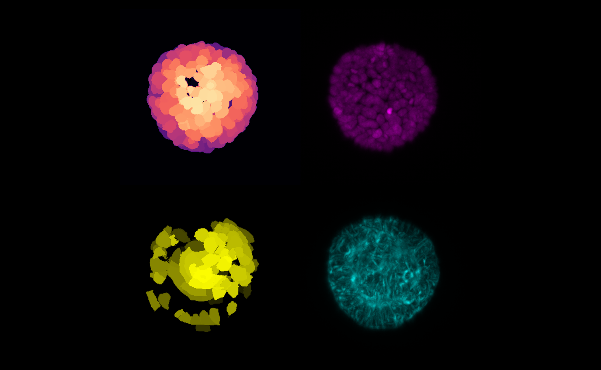

# zarr_parallel_processing

This is a scratch repo for the OME-NGFF Hackathon Zurich 2024

required cellpose version: 2.2.1

**Input**:

Shape: (279, 2, 91, 554, 928)

Size: ~50 gb
 

**Example for otsu segmentation**:

n_workers = 4

threads_per_worker = 1

region_shape = (1, 1, 91, 554, 928) 

Output chunks: (1, 1, 48, 128, 128)

Read-process-write took roughly 4-5 min.

**Example output for cellpose segmentation:**

Shape: (279, 2, 91, 317, 325)

Size: ~10 gb

